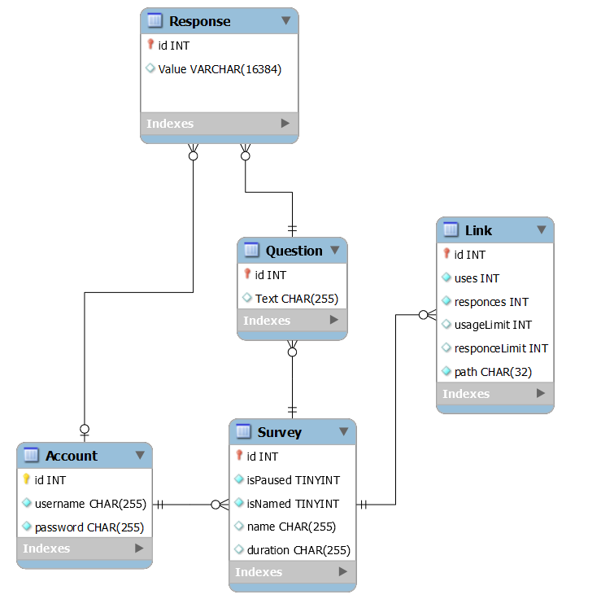

# Проєктування бази даних

## BE модель

@startuml

entity Account <<ENTITY>>
entity Account.username <<TEXT>>
entity Account.password <<TEXT>>

entity Survey <<ENTITY>>
entity Survey.name <<TEXT>>
entity Survey.duration <<TEXT>>
entity Survey.isPaused <<BOOLEAN>>
entity Survey.isNamed <<BOOLEAN>>

entity Question <<ENTITY>>
entity Question.text <<TEXT>>

entity Responce <<ENTITY>>
entity Responce.value <<TEXT>>

entity Link <<ENTITY>>
entity Link.usageLimit <<INT>>
entity Link.responceLimit <<INT>>
entity Link.uses <<INT>>
entity Link.responces <<INT>>
entity Link.path <<TEXT>>

Account.username --* Account
Account.password --* Account

Survey.name --* Survey
Survey.duration --* Survey
Survey.isPaused --* Survey
Survey.isNamed --* Survey

Link.usageLimit -u-* Link
Link.responceLimit -u-* Link
Link.uses --* Link
Link.responces --* Link
Link.path -u-* Link

Responce.value -u-* Responce

Question.text -u-* Question

Account "1,1" -- "0,*" Survey
Survey "1,1" -- "0,*" Question
Question "1,1" -r- "0,*" Responce
Account "0,1" -r- "0,*" Responce
Link "0,*" -- "1,1" Survey

@enduml

## ER-модель

@startuml

entity Account <<ENTITY>> {
    id:INT
    username:CHAR(64)
    password:CHAR(256)
}

entity Responce <<ENTITY>> {
    id:INT
    value:CHAR(16384)
}

entity Question <<ENTITY>> {
    id:INT
    text:CHAR(256)
}

entity Survey <<ENTITY>> {
    id:INT
    name:CHAR(256)
    duration:CHAR(256)
    isPaused:BOOLEAN
    isNamed:BOOLEAN
}

entity Link <<ENTITY>> {
    id:INT
    uses:INT
    responces:INT
    usageLimit:INT
    responceLimit:INT
    path:CHAR(32)
}

Responce "0,*" --> "1,1" Question
Question "0,*" --> "1,1" Survey
Survey "0,*" --> "1,1" Account
Link "0,*" --> "1,1" Survey
Responce "0,*" --> "0,1" Account

@enduml

## Реляційна схема

