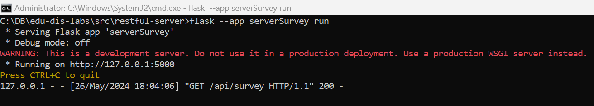
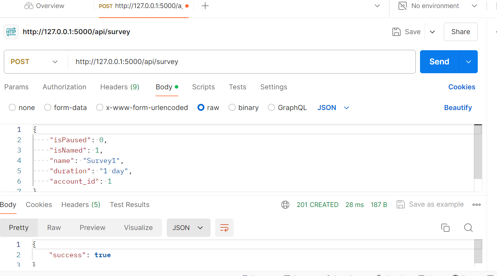
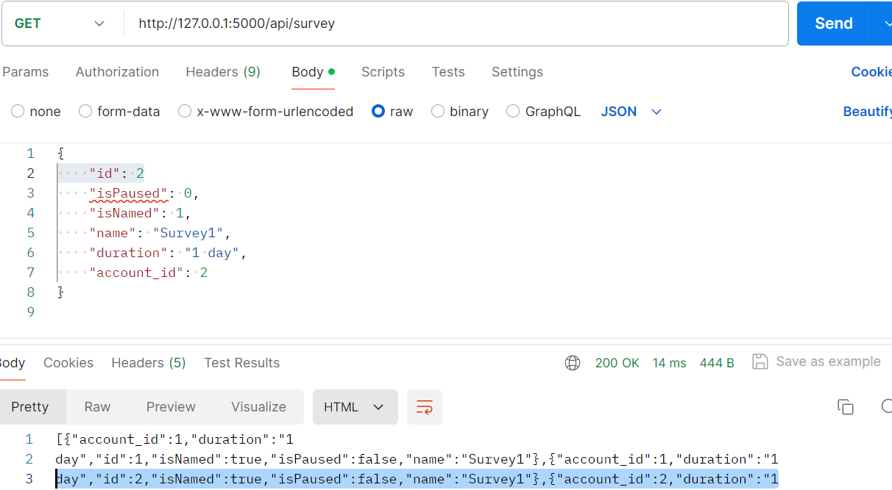
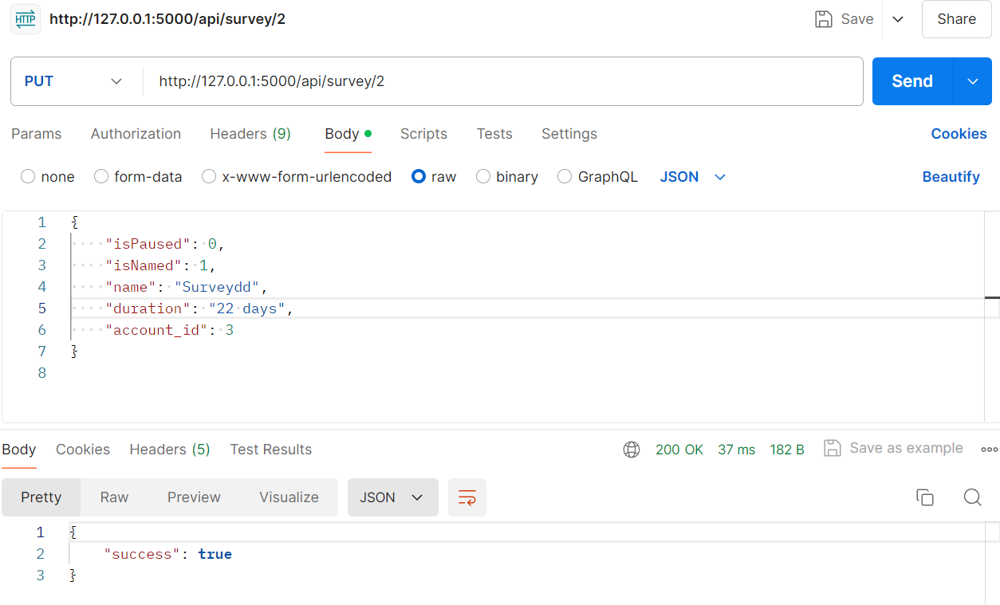
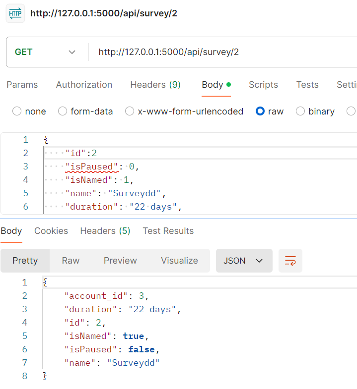
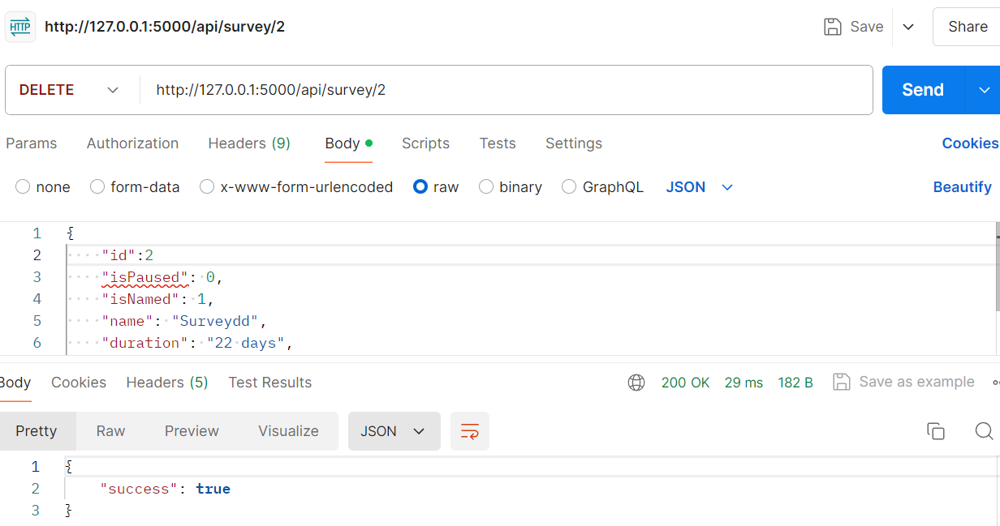
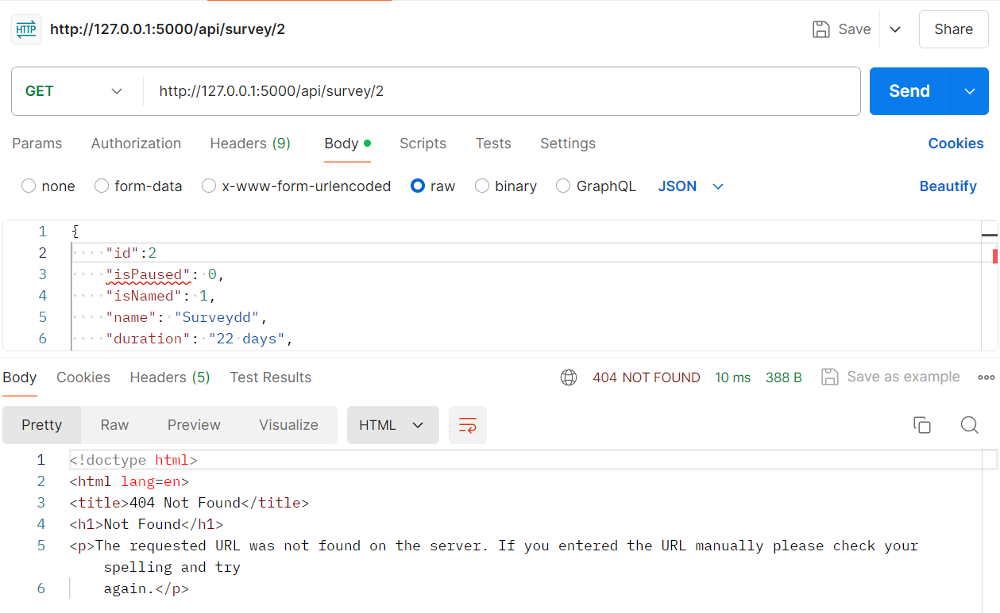

# Тестування працездатності системи

Тестування працездатності системи
Для тестування системи використовувся додаток Postman

Запуск сервера:

Метод POST
POST Survey
Запит та відповідь:

Перевірка за допомогою GET:
](image-2.png)

Метод PUT
PUT Survey
Запит та відповідь:

Перевірка за допомогою GET:

Метод DELETE
DELETE Survey
Запит та відповідь:

Перевірка за допомогою GET:

